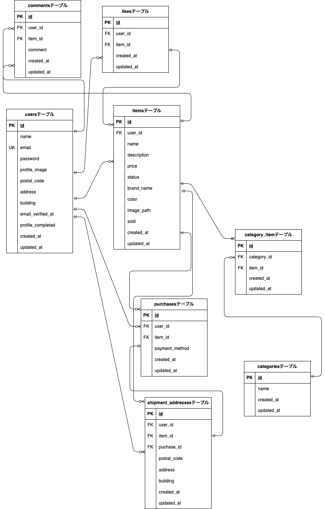

# アプリケーション名
coachtech-flema
フリマアプリ

## 作成した目的
日常よく見かけ、実際に利用する機会も多いアプリケーションなので、構築方法を学びたいため

## 機能一覧
会員登録（登録認証、入力フォーム、バリデーション、エラーメッセージ表示、認証導線、初回ログイン時ユーザー設定）
ログイン（ログイン認証、入力フォーム、バリデーション、、エラーメッセージ表示、認証導線、メール認証）
ログアウト
商品一覧の確認（商品一覧取得、マイリスト一覧取得、商品検索）
商品詳細の確認（商品詳細情報取得、いいね機能、購入手続き導線、コメント送信）
商品購入（購入前商品情報取得、商品購入、支払い方法選択、配送先変更）
自身のプロフィール確認（ユーザー情報取得、プロフィール編集導線）
自身のプロフィール編集（ユーザー情報変更）
商品出品（出品商品登録）

## 使用技術
- Laravel 8.83.29
- PHP 7.4.9
- MySQL 8.0.26

## テーブル設計
### users テーブル
| カラム名    | 型        | 制約            |
|------------|----------|----------------|
| id         | UNSIGHT BIGINT   | 主キー         |
| name       | VARCHAR(255)   | NOT NULL       |
| email      | VARCHAR(255)  | UNIQUE, NOT NULL |
| password   | VARCHAR(255)   | NOT NULL       |
| profile_image | VARCHAR(255) |            |
| postal_code | VARCHAR(10) |               |
| address | text |                          |
|building | VARCHAR(255) |                  |
| email_verfied_at | TIMESTAMP |               |
| profile_completed | boolean |             |
|created_at | TIMESTAMP | 自動生成      |
| updated_at | TIMESTAMP | 自動生成      |

### items テーブル
| カラム名    | 型       | 制約                     |
|------------|---------|--------------------------|
| id         | UNSIGHT BIGINT  | 主キー                   |
| user_id    | UNSIGHT BIGINT  | 外部キー（users.id）     |
| name      | VARCHAR(255)  | NOT NULL         |
| description | TEXT   | NOT NULL                 |
| price  | INT   | NOT NULL                  |
| status | ENUM | NOT NULL                    |
| brand_name | VARCHAR(255) |                 |
| color | VARCHAR(255) |                      |
| image_path | VARCHAR(255) |                  |
| sold | BOOLEAN |                             |
| created_at | TIMESTAMP | 自動生成               |
| updated_at | TIMESTAMP | 自動生成               |

### likes テーブル
| カラム名       | 型       | 制約                     |
|--------------|---------|--------------------------|
| id           | UNSIGHT BIGINT  | 主キー            |
| user_id    | UNSIGHT BIGINT  | 外部キー（users.id）     |
| item_id    | UNSIGHT BIGINT  | 外部キー（items.id）     |
| created_at   | TIMESTAMP | 自動生成               |
| updated_at   | TIMESTAMP | 自動生成               |

### comments テーブル
| カラム名       | 型       | 制約                     |
|--------------|---------|--------------------------|
| id           | UNSIGHT BIGINT  | 主キー            |
| user_id    | UNSIGHT BIGINT  | 外部キー（users.id）     |
| item_id    | UNSIGHT BIGINT  | 外部キー（items.id）     |
| comment | text | NOT NULL                        |
| created_at   | TIMESTAMP | 自動生成               |
| updated_at   | TIMESTAMP | 自動生成               |

### purchases テーブル
| カラム名       | 型       | 制約                     |
|--------------|---------|--------------------------|
| id           | UNSIGHT BIGINT  | 主キー            |
| user_id    | UNSIGHT BIGINT  | 外部キー（users.id）     |
| item_id    | UNSIGHT BIGINT  | 外部キー（items.id）     |
| payment_method | enum('convenience', 'credit_card') | NOT NULL |
| created_at   | TIMESTAMP | 自動生成               |
| updated_at   | TIMESSTAMP | 自動生成              |

### shipment_addresses テーブル
| カラム名       | 型       | 制約                     |
|--------------|---------|--------------------------|
| id           | UNSIGHT BIGINT  | 主キー            |
| user_id    | UNSIGHT BIGINT  | 外部キー（users.id）     |
| item_id    | UNSIGHT BIGINT  | 外部キー（items.id）     |
| purchase_id | UNSIGHT BIGINT | 外部キー（purchases.id） |
| name         | VARCHAR(255) | NOT NULL                   |
| postal_code | VARCHAR(10) | NOT NULL                |
|address      | TEXT | NOT NULL                         |
| building | VARCHAR(255) |                        |
| created_at   | TIMESTAMP | 自動生成               |
| updated_at   | TIMESSTAMP | 自動生成              |

### category_item テーブル
| カラム名       | 型       | 制約                     |
|--------------|---------|--------------------------|
| id           | UNSIGHT BIGINT  | 主キー            |
| category_id    | UNSIGHT BIGINT  | 外部キー（categories.id）     |
| item_id    | UNSIGHT BIGINT  | 外部キー（items.id）     |
| created_at   | TIMESTAMP | 自動生成               |
| updated_at   | TIMESSTAMP | 自動生成              |

## ER図


## 環境構築

### **Docker ビルド**
1. **プロジェクトをクローン**
   ```bash
   git clone git@github.com:mihonitou/atte3.git
   ```
2. DockerDesktop アプリを立ち上げる
3. Docker コンテナをビルドして起動
   ```bash
   docker compose up -d --build
   ```
⚠ no matching manifest for linux/arm64/v8 in the manifest list entries
というエラーが出た場合は、docker-compose.yml に以下の記述を追加
```yaml
mysql:
  image: mysql:8.0.26
  platform: linux/amd64

phpmyadmin:
  image: phpmyadmin/phpmyadmin:latest
  platform: linux/amd64
```
**Laravel環境構築**
1. コンテナに入る
```bash
docker compose exec php bash
```
2. Composer をインストール
```bash
composer install
```
3. .env ファイルを作成
```bash
cp .env.example .env
```
4. データベース接続情報を .env に追加
```text
DB_CONNECTION=mysql
DB_HOST=mysql
DB_PORT=3306
DB_DATABASE=laravel_db
DB_USERNAME=laravel_user
DB_PASSWORD=laravel_pass
```
5. アプリケーションキーの作成
```bash
php artisan key:generate
```
6. マイグレーションの実行
```bash
php artisan migrate
```
7. シーディングの実行（ダミーデータ作成）
```bash
php artisan db:seed
```
## **URL**
| 環境          | URL                     |
|-------------|-------------------------|
| 開発環境       | [http://localhost/](http://localhost/) |
| phpMyAdmin | [http://localhost:8080/](http://localhost:8080/) |

## テストユーザー・商品
### テストユーザー情報

| 名前         | メールアドレス        | パスワード       | 郵便番号   | 住所              | 建物名             |
|--------------|------------------------|------------------|------------|-------------------|--------------------|
| 佐藤 花子     | hanako@example.com     | password123      | 123-4567   | 東京都新宿区1-1-1 | ハナコマンション101 |
| 鈴木 太郎     | taro@example.com       | password456      | 987-6543   | 大阪府大阪市2-2-2 | スズキビル202       |

※ 上記2ユーザーは `email_verified_at` 設定済み、`profile_completed` = `true`。
---

### 商品情報（ItemsTableSeeder にて登録）

| 商品名       | 出品者   | カテゴリ              | ブランド名        | 状態                  | 価格     |
|--------------|----------|------------------------|-------------------|------------------------|----------|
| 腕時計       | 鈴木 太郎 | ファッション, メンズ   | ARMANI            | 良好                   | ¥15,000  |
| HDD          | 佐藤 花子 | 家電                   | Western Digital   | 目立った傷や汚れなし  | ¥5,000   |
| 玉ねぎ3束    | 佐藤 花子 | 食品                   | -                 | やや傷や汚れあり      | ¥300     |
| 革靴         | 鈴木 太郎 | ファッション, メンズ   | REGAL             | 状態が悪い            | ¥4,000   |
| ノートPC     | 鈴木 太郎 | 家電                   | DELL              | 良好                   | ¥45,000  |
| マイク       | 鈴木 太郎 | 家電                   | Blue              | 目立った傷や汚れなし  | ¥8,000   |
| ショルダーバッグ | 佐藤 花子 | ファッション, レディース | Nine West         | やや傷や汚れあり      | ¥3,500   |
| タンブラー   | 佐藤 花子 | キッチン               | THERMOS           | 状態が悪い            | ¥500     |
| コーヒーミル | 鈴木 太郎 | キッチン               | Kalita            | 良好                   | ¥4,000   |
| メイクセット | 佐藤 花子 | コスメ                 | CANMAKE           | 目立った傷や汚れなし  | ¥2,500   |

※ 商品画像は S3 にアップ済みのURLを使用しています。

---

### 備考

- `UserSeeder` および `ItemsTableSeeder` を `DatabaseSeeder` に登録して `php artisan db:seed` 実行してください。
- カテゴリは事前に `CategoriesTableSeeder` にて登録しておく必要があります。